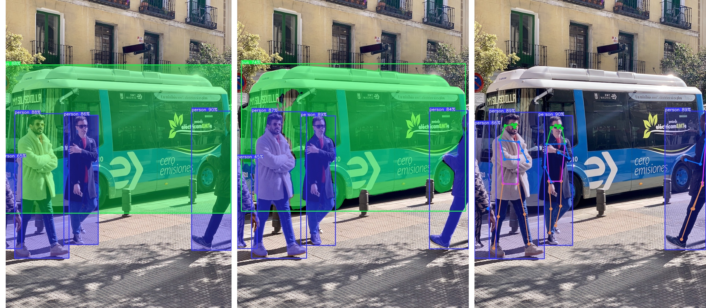

# YOLOv8_ONNX

Use the YOLOv8 model in ONNX to perform the following tasks:
- object detection
- instance segmentation
- pose estimation


The above results are from YOLOv8n.

## Examples

1. Convert model to ONNX

```sh
python export.py
```

2. Inference

```python
import cv2
from YOLOv8_ONNX import YOLOv8, YOLOv8Seg, YOLOv8Pose

yolo = YOLOv8("models/yolov8n.onnx", conf_thres=0.3, iou_thres=0.5)
# yolo = YOLOv8Seg("models/yolov8n-seg.onnx", conf_thres=0.3, iou_thres=0.5)
# yolo = YOLOv8Pose("models/yolov8n-pose.onnx", conf_thres=0.3, iou_thres=0.5)

img = cv2.imread("assets/bus.jpg", cv2.IMREAD_COLOR)

# Detect Objects
yolo(img)

# Draw detections
combined_img = yolo.draw_results(img)
cv2.namedWindow("Output", cv2.WINDOW_NORMAL)
cv2.imshow("Output", combined_img)
cv2.waitKey(0)
```

3. Quantization

```sh
python quant.py
```

4. Benchmark

```sh
python perf.py
```

## References:

- YOLOv8 model: https://github.com/ultralytics/ultralytics
- https://github.com/ibaiGorordo/ONNX-YOLOv8-Object-Detection
- https://github.com/ibaiGorordo/ONNX-YOLOv8-Instance-Segmentation
